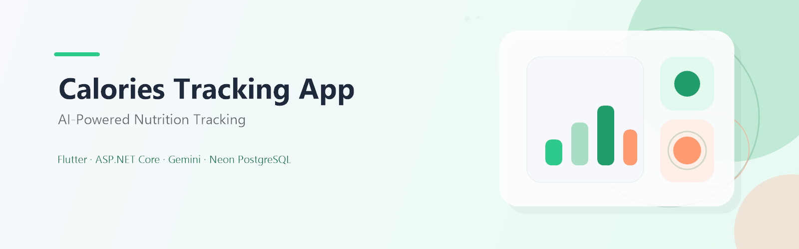
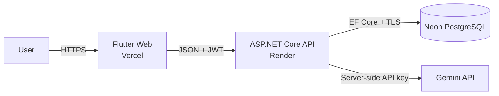

# Calories Tracking App

<p align="center">
  <a href="https://calories-tracking-app-ten.vercel.app/">
    
  </a>
</p>

<p align="center">
  <a href="https://calories-tracking-app-ten.vercel.app/"></a>
</p>

Ứng dụng theo dõi calo và dinh dưỡng có trợ lý AI: bạn ghi nhật ký bữa ăn, tra cứu thực phẩm và gửi ảnh món ăn để backend phân tích với Gemini.

> **English** — A full-stack calorie and nutrition tracker with Flutter Web, an ASP.NET Core API, USDA food search, and server-side Gemini image analysis.

<p align="center">
  
  
  
  
  
  
  
  
</p>

<p align="center">
  
  
</p>

## 🚀 Trải nghiệm trực tiếp

- **Frontend:** [calories-tracking-app-ten.vercel.app](https://calories-tracking-app-ten.vercel.app/)
- **Backend liveness:** [health/live](https://calories-tracking-api-wno2.onrender.com/health/live)

Production topology: Flutter Web chạy trên Vercel, ASP.NET Core API chạy trên Render và dữ liệu dùng Neon PostgreSQL. Gemini chỉ được gọi từ backend. Render Free có thể cold start sau một thời gian không hoạt động, vì vậy request đầu tiên đôi khi mất thêm thời gian.

## Tổng quan

Calories Tracking App giúp bạn theo dõi năng lượng và dinh dưỡng theo ngày. Ứng dụng hỗ trợ phân tích ảnh món ăn bằng Gemini thông qua backend, tìm kiếm thực phẩm từ USDA, thiết lập hồ sơ và mục tiêu calo, ghi nhật ký bữa ăn, xem thống kê bảy ngày, và giữ ranh giới rõ ràng giữa frontend và backend.

## Tính năng đã hoàn thành

| Nhóm | Trạng thái |
| --- | --- |
| Phân tích ảnh món ăn bằng Gemini | Đã triển khai; request đi qua API backend |
| Đăng ký, đăng nhập, JWT và BCrypt | Đã triển khai |
| Hồ sơ cá nhân và mục tiêu calo | Đã triển khai |
| Tìm kiếm thực phẩm USDA | Đã triển khai |
| Nhật ký bữa ăn server-first | Đã triển khai; backend là source of truth |
| Thống kê bảy ngày | Đã triển khai |
| Rate limiting | Đã triển khai cho các endpoint nhạy cảm |
| Health checks và production deployment | Đã cấu hình cho Render/Vercel/Neon |

## 🧰 Công nghệ

| Nhóm | Thành phần |
| --- | --- |
| Frontend | Flutter, Dart, Riverpod, Dio, go_router |
| Backend | ASP.NET Core, .NET 9, Clean Architecture, EF Core, JWT, BCrypt, rate limiting |
| Data / AI | PostgreSQL, Neon, SQLite (development), USDA, Gemini |
| Infrastructure | GitHub Actions, Vercel, Render, Docker |

## 🏗️ Kiến trúc



- Flutter gửi request HTTPS/JSON và JWT đến API; API xác thực token trước khi xử lý tài nguyên người dùng.
- Gemini API key chỉ tồn tại ở backend, không được đưa vào Flutter Web hoặc `--dart-define`.
- Nhật ký bữa ăn được đọc/ghi qua Diary API; backend là nguồn dữ liệu chính thay vì chỉ dựa vào bộ nhớ cục bộ.
- Xem sơ đồ luồng và ranh giới module trong [docs/SYSTEM_ARCHITECTURE.md](docs/SYSTEM_ARCHITECTURE.md).

## ☁️ Production deployment

| Thành phần | Nền tảng | Endpoint / ghi chú |
| --- | --- | --- |
| Frontend | Vercel | [Live app](https://calories-tracking-app-ten.vercel.app/) |
| Backend | Render Free | [Liveness](https://calories-tracking-api-wno2.onrender.com/health/live); readiness dùng `/health` |
| Database | Neon PostgreSQL | Kết nối TLS; setup này không có private endpoint |
| AI | Gemini | Chỉ gọi từ backend; API key không nằm trong client |

## ⚡ Quick Start

### Prerequisites

- Flutter SDK stable và Google Chrome
- .NET SDK 9+
- Gemini API key để dùng tính năng phân tích ảnh

### Backend

```powershell
cd backend/src/CaloriesTracking.Api
dotnet user-secrets set "Gemini:ApiKey" "YOUR_GEMINI_API_KEY"
dotnet user-secrets set "Jwt:Key" "YOUR_RANDOM_JWT_KEY_AT_LEAST_32_CHARACTERS"
dotnet run
```

API chạy tại `http://localhost:5210`.

### Flutter Web

```powershell
flutter pub get
flutter run -d chrome --dart-define=BACKEND_BASE_URL=http://localhost:5210
```

### Android emulator

```powershell
flutter run --dart-define=BACKEND_BASE_URL=http://10.0.2.2:5210
```

<details>
<summary>Environment variables</summary>

ASP.NET Core dùng dấu hai chấm (`:`) cho user-secrets ở local và dấu gạch dưới kép (`__`) cho environment variables trên Render. Hai kiểu này tương đương theo section nhưng không phải cú pháp thay thế trong cùng một lệnh.

**Backend**

| Môi trường | Tên | Mục đích |
| --- | --- | --- |
| Local user-secrets | `Gemini:ApiKey` | Gemini key cho backend development |
| Local user-secrets | `Jwt:Key` | JWT signing key dài tối thiểu 32 ký tự |
| Render environment | `GEMINI__APIKEY` | Gemini key production |
| Render environment | `JWT__KEY` | JWT signing key production |
| ASP.NET Core / Render | `ConnectionStrings:DefaultConnection` ↔ `ConnectionStrings__DefaultConnection` | Chuỗi kết nối database; production dùng Neon PostgreSQL URI với TLS |
| ASP.NET Core / Render | `Cors:AllowedOrigins:0` ↔ `CORS__ALLOWEDORIGINS__0` | Origin HTTPS đầu tiên được phép gọi API, chẳng hạn origin của frontend Vercel |

**Frontend**

| Cách chạy | Tên | Mục đích |
| --- | --- | --- |
| `--dart-define` | `BACKEND_BASE_URL` | Base URL của API; không thêm `/api` hoặc dấu `/` cuối |

</details>

## 📁 Cấu trúc dự án

```text
lib/                    # Flutter app: features, routing, network, state
backend/                # .NET solution: API, application, domain, infrastructure
docs/                   # Architecture, API, setup, deployment, SDD
scripts/                # Build, validation, data and secret-scan tooling
test/                   # Flutter unit/widget tests
.github/workflows/      # Flutter CI and backend CI
```

## ✅ Testing & quality

CI kiểm tra các lớp chất lượng thực tế của repository:

- Flutter analyze, test và web release build; đồng thời kiểm tra cấu hình Vercel và phạm vi upload.
- Backend Release build và test; PostgreSQL integration test qua TLS.
- Docker production-container smoke test và kiểm tra seed data.
- Tracked-secret scan bắt buộc trước các job backend.
- Backend test suite xác thực contract của Render Blueprint trong [`render.yaml`](render.yaml); các bước provider-specific trong [DEPLOY_RENDER.md](docs/DEPLOY_RENDER.md) vẫn cần xác minh thủ công.

Xem workflow: [Flutter CI](.github/workflows/flutter-ci.yml) · [Backend CI](.github/workflows/backend-ci.yml).

## 🔒 Bảo mật

- Gemini key chỉ cấu hình và gọi ở backend; Flutter Web không chứa secret.
- Mật khẩu được hash bằng BCrypt; JWT được kiểm tra theo cấu hình production của API.
- PostgreSQL production yêu cầu TLS và channel binding trong connection string.
- CORS chỉ cho phép các HTTPS origin đã cấu hình; rate limiting giảm lạm dụng endpoint.
- CI quét tracked secrets; không đưa credentials thật vào source, README hoặc `--dart-define`.

## 📚 Tài liệu

- [SYSTEM_ARCHITECTURE.md](docs/SYSTEM_ARCHITECTURE.md) — luồng dữ liệu và ranh giới module
- [API_SPEC.md](docs/API_SPEC.md) — API contract và payload
- [DEPLOYMENT_GUIDE.md](docs/DEPLOYMENT_GUIDE.md) — checklist triển khai và smoke test
- [DEPLOY_RENDER.md](docs/DEPLOY_RENDER.md) — Render, Neon và Vercel operator guide
- [DEV_SETUP.md](docs/DEV_SETUP.md) — setup local và chạy full stack
- [SPEC_DRIVEN_DEVELOPMENT.md](docs/SPEC_DRIVEN_DEVELOPMENT.md) — quy trình phát triển theo spec

## 🗺️ Roadmap

- Secure JWT storage và refresh-token flow.
- Lưu avatar thật thay cho storage giả lập hiện tại.
- Offline cache cho nhật ký bữa ăn.

## Contributors

Bạn có thể xem [contributors graph](https://github.com/trangkhanh-ai/Calories-Tracking-App/graphs/contributors) để biết những người đã đóng góp cho repository.

---

<p align="center">
  <a href="https://github.com/trangkhanh-ai/Calories-Tracking-App">Calories Tracking App</a> ·
  <a href="https://calories-tracking-app-ten.vercel.app/">Live app</a> ·
  <a href="https://github.com/trangkhanh-ai/Calories-Tracking-App">Repository</a>
</p>
