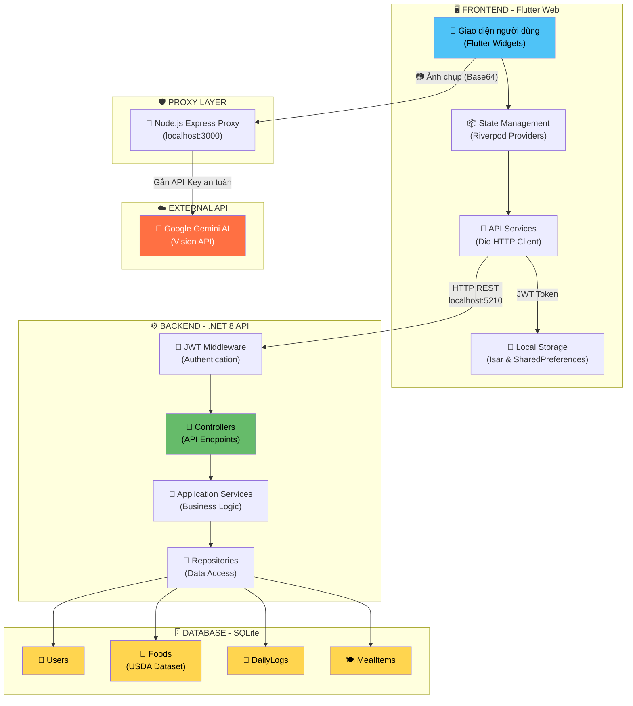
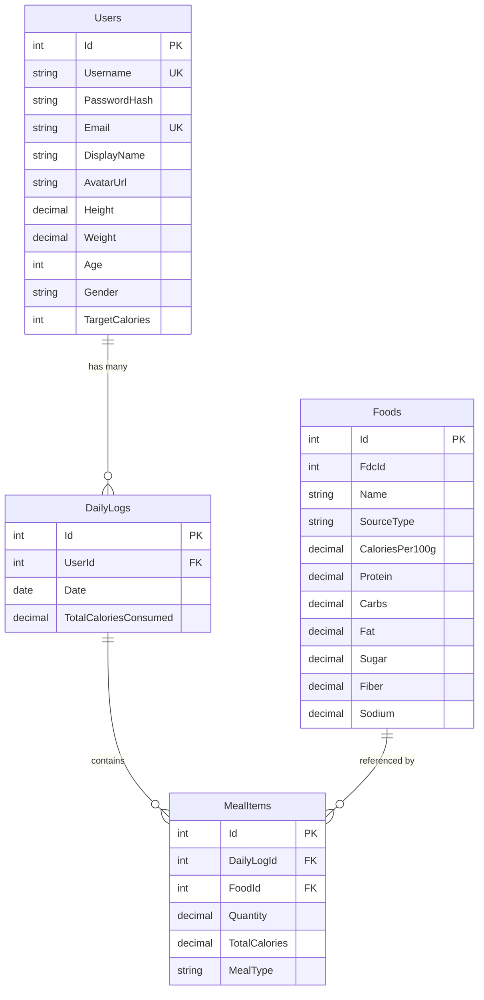
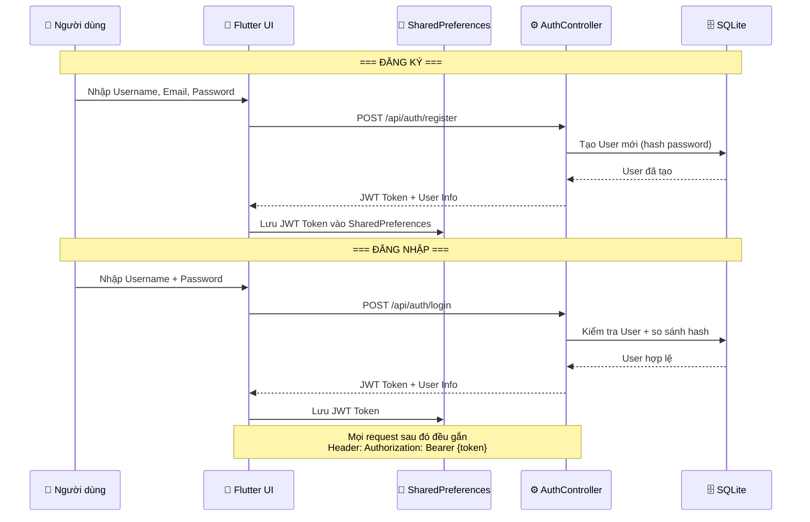
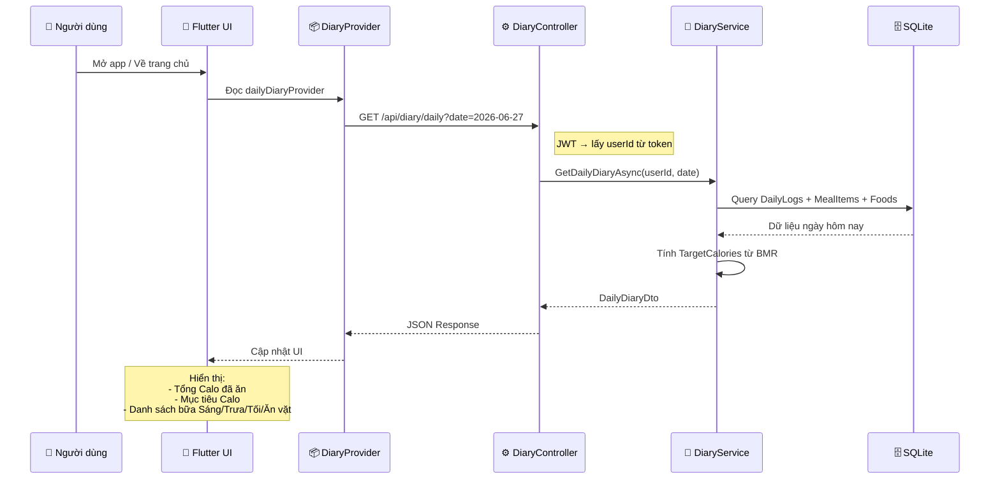
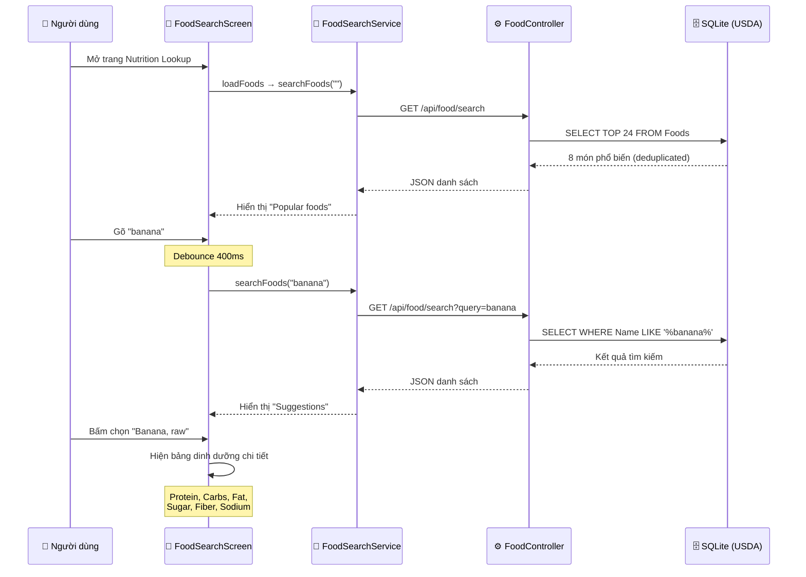
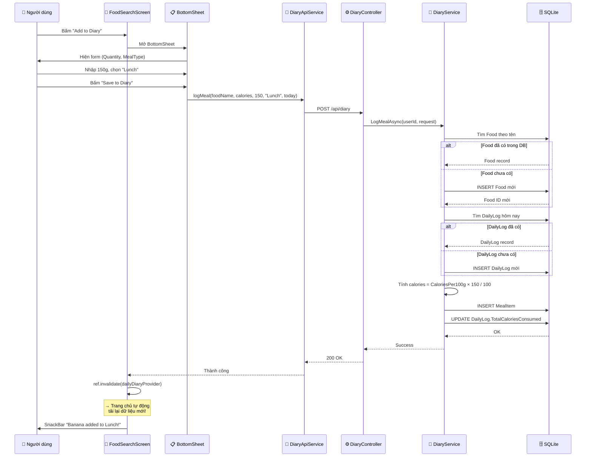
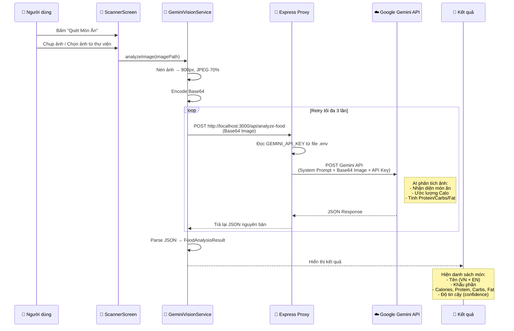
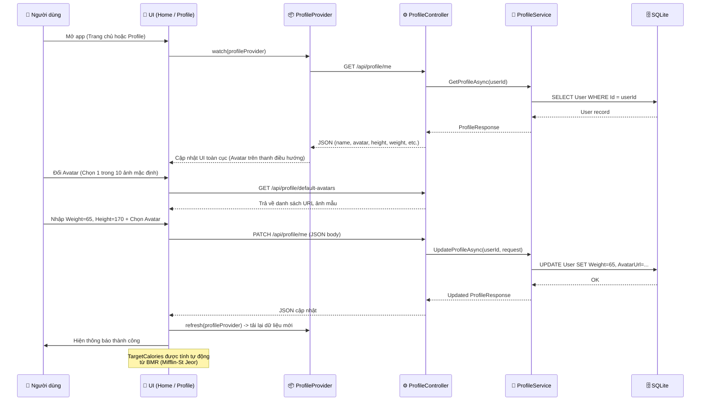
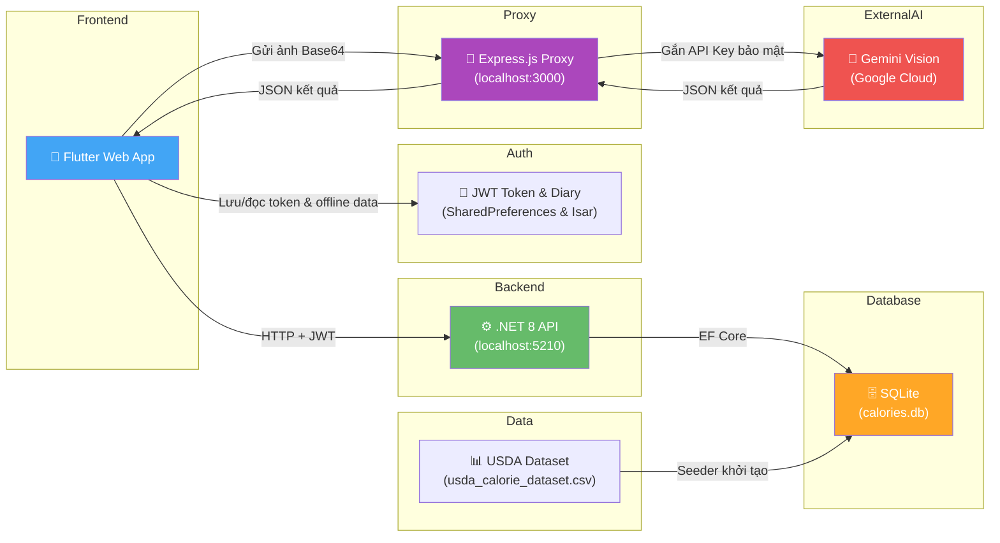

# 📊 Phân Tích Luồng Hoạt Động Dữ Liệu - Calories-Tracking-App

---

## 1. Kiến Trúc Tổng Quan (Architecture Overview)

---

## 2. Sơ Đồ Database (Entity Relationship)

---

## 3. Luồng Từng Tính Năng

### 🔐 Luồng 1: Đăng Ký / Đăng Nhập (Auth)

### 📅 Luồng 2: Xem Nhật Ký Hôm Nay (Diary - Trang Chủ)

### 🔍 Luồng 3: Tra Cứu Dinh Dưỡng (Food Search)

### ➕ Luồng 4: Thêm Vào Nhật Ký (Add to Diary)

### 📷 Luồng 5: Quét Món Ăn Bằng AI (Scanner)

### 👤 Luồng 6: Quản Lý Hồ Sơ & Avatar Toàn Cục (Profile)

---

## 4. Tổng Hợp API Endpoints

| # | Method | Endpoint | Đăng nhập? | Mô tả | Trạng thái |
|---|--------|----------|-----------|-------|-----------|
| 1 | POST | `/api/auth/register` | 🔓 Công khai | Đăng ký tài khoản mới | ✅ Hoạt động |
| 2 | POST | `/api/auth/login` | 🔓 Công khai | Đăng nhập, nhận JWT token | ✅ Hoạt động |
| 3 | GET | `/api/diary/daily?date=` | 🔒 Cần đăng nhập | Lấy nhật ký ăn uống theo ngày | ✅ Hoạt động |
| 4 | POST | `/api/diary` | 🔒 Cần đăng nhập | Thêm món ăn vào nhật ký | ✅ Hoạt động |
| 5 | GET | `/api/diary/stats?start=&end=` | 🔒 Cần đăng nhập | Thống kê Calo theo khoảng thời gian | ✅ Hoạt động |
| 6 | GET | `/api/food/search?query=` | 🔓 Công khai* | Tìm kiếm thực phẩm trong USDA | ✅ Hoạt động |
| 7 | GET | `/api/profile/me` | 🔒 Cần đăng nhập | Lấy thông tin hồ sơ | ✅ Hoạt động |
| 8 | PATCH | `/api/profile/me` | 🔒 Cần đăng nhập | Cập nhật hồ sơ | ✅ Hoạt động |
| 9 | GET | `/api/profile/default-avatars` | 🔓 Công khai | Danh sách avatar mặc định | ✅ Hoạt động |

> **Chú thích cột "Đăng nhập?":**
> - 🔓 **Công khai** = Không cần đăng nhập, ai cũng gọi được API này
> - 🔒 **Cần đăng nhập** = Phải gửi kèm JWT Token (phải đăng nhập trước)
>
> *\* FoodController hiện tạm tắt `[Authorize]` để dễ test, khi đưa lên production nên bật lại*

---

## 5. Luồng Dữ Liệu Tổng Hợp (Full Picture)

> [!IMPORTANT]
> **Điểm đặc biệt được nâng cấp (Bảo mật)**: Tính năng Scanner (Quét ảnh AI) hiện tại gọi qua **Node.js Express Proxy (localhost:3000)** thay vì gọi trực tiếp đến Google Gemini API. Proxy server sẽ tự động đính kèm `GEMINI_API_KEY` lấy từ biến môi trường `.env`. Điều này giúp bảo mật hoàn toàn API Key, tránh bị lộ ở client (Flutter Web/App), đồng thời vẫn giữ được hiệu năng cao và độc lập với Backend .NET chính.
