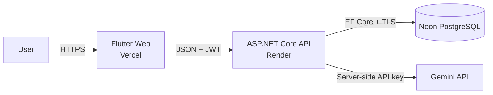

# Professional Repository Showcase Implementation Plan

> **For agentic workers:** REQUIRED SUB-SKILL: Use superpowers:subagent-driven-development (recommended) or superpowers:executing-plans to implement this plan task-by-task. Steps use checkbox (`- [ ]`) syntax for tracking.

**Goal:** Turn the public GitHub landing page into a polished product-first showcase that links to the live app while accurately explaining the verified architecture, stack, setup, quality pipeline, and documentation.

**Architecture:** Keep application and deployment code untouched. Add a README presentation layer, project-owned geometric PNG assets, and safe unauthenticated screenshots, then validate links, Markdown, images, and tracked-secret safety. Push one documentation branch and open one PR against `main` without merging it.

**Tech Stack:** GitHub Markdown/HTML, Mermaid, Chrome headless, PowerShell `System.Drawing`, GitHub CLI, and the repository tracked-secret scanner.

---

## Fixed Context

- Work only on `docs/professional-repository-showcase`.
- The isolated checkout is `build/codex-docs-repo`; the original checkout remains on clean `main` because its `.git` directory is read-only in this environment.
- Never inspect `.env`, `.env.local`, `.vercel`, user-secrets, tokens, API keys, JWT values, database credentials, or normal browser profiles.
- Never create a production account, authenticate to production, upload food images, deploy, force-push, modify application/deployment/CI behavior, or merge the PR.
- Frontend: `https://calories-tracking-app-ten.vercel.app/`.
- Liveness: `https://calories-tracking-api-wno2.onrender.com/health/live`.

## File Map

- Modify `README.md`: complete repository landing page.
- Create `docs/assets/repository-banner.png`: 1600 x 500 Product-first Bento banner.
- Create `docs/assets/github-social-preview.png`: 1280 x 640 social-preview handoff.
- Create, after safety review, `docs/screenshots/login-desktop.png`.
- Create, after safety review, `docs/screenshots/login-mobile.png`.
- Create, after safety review, `docs/screenshots/register-desktop.png`.
- Create, after safety review, `docs/screenshots/register-mobile.png`.
- Keep temporary screenshot profiles and asset-generation scripts under ignored `build/` only.
- Do not modify Flutter, backend, migrations, deployment files, or workflows.

## Task 1: Verify Branch And Public Endpoints

**Files:** None.

- [ ] **Step 1: Confirm the isolated checkout**

Run:

```powershell
git branch --show-current
git status --short
git rev-parse HEAD
git rev-parse origin/main
```

Expected: branch `docs/professional-repository-showcase`, no worktree changes before implementation, and a known base commit from `origin/main`.

- [ ] **Step 2: Check the frontend without authentication**

Run:

```powershell
$response = Invoke-WebRequest -UseBasicParsing -Uri 'https://calories-tracking-app-ten.vercel.app/' -MaximumRedirection 5 -TimeoutSec 30
"frontend_status=$($response.StatusCode)"
```

Expected: HTTP success. Do not print response bodies, headers, cookies, or runtime configuration.

- [ ] **Step 3: Check liveness with cold-start tolerance**

Run:

```powershell
$uri = 'https://calories-tracking-api-wno2.onrender.com/health/live'
$ok = $false
for ($attempt = 1; $attempt -le 4; $attempt++) {
  $started = Get-Date
  try {
    $response = Invoke-WebRequest -UseBasicParsing -Uri $uri -TimeoutSec 45
    $seconds = [int]((Get-Date) - $started).TotalSeconds
    "attempt=$attempt status=$($response.StatusCode) elapsed=${seconds}s"
    if ($response.StatusCode -eq 200) { $ok = $true; break }
  } catch {
    $seconds = [int]((Get-Date) - $started).TotalSeconds
    "attempt=$attempt status=retryable-failure elapsed=${seconds}s"
  }
  if ($attempt -lt 4) { Start-Sleep -Seconds 5 }
}
if (-not $ok) { throw 'Liveness did not return HTTP 200 after four safe attempts' }
```

Expected: one attempt returns HTTP 200. Do not call authenticated endpoints.

## Task 2: Capture Safe Public Screenshots

**Files:**
- Create `docs/screenshots/login-desktop.png`.
- Create `docs/screenshots/login-mobile.png`.
- Create `docs/screenshots/register-desktop.png`.
- Create `docs/screenshots/register-mobile.png`.

- [ ] **Step 1: Create isolated output and browser-profile directories**

Run:

```powershell
$chrome = 'C:\Program Files\Google\Chrome\Application\chrome.exe'
if (-not (Test-Path $chrome)) { throw 'Chrome executable was not found' }
New-Item -ItemType Directory -Force -Path 'docs/screenshots','build/chrome-profile' | Out-Null
```

Use only this new profile; never use the user's browser profile.

- [ ] **Step 2: Capture login and registration at desktop and mobile viewports**

Run:

```powershell
$chrome = 'C:\Program Files\Google\Chrome\Application\chrome.exe'
$profile = (Resolve-Path 'build/chrome-profile').Path
$output = (Resolve-Path 'docs/screenshots').Path
$frontend = 'https://calories-tracking-app-ten.vercel.app'
$loginDesktop = Join-Path $output 'login-desktop.png'
$loginMobile = Join-Path $output 'login-mobile.png'
$registerDesktop = Join-Path $output 'register-desktop.png'
$registerMobile = Join-Path $output 'register-mobile.png'
& $chrome --headless=new --disable-gpu --hide-scrollbars --incognito --no-first-run --disable-extensions "--user-data-dir=$profile" --virtual-time-budget=8000 --window-size=1440,900 "--screenshot=$loginDesktop" "$frontend/login"
& $chrome --headless=new --disable-gpu --hide-scrollbars --incognito --no-first-run --disable-extensions "--user-data-dir=$profile" --virtual-time-budget=8000 --window-size=390,844 --force-device-scale-factor=1 "--screenshot=$loginMobile" "$frontend/login"
& $chrome --headless=new --disable-gpu --hide-scrollbars --incognito --no-first-run --disable-extensions "--user-data-dir=$profile" --virtual-time-budget=8000 --window-size=1440,900 "--screenshot=$registerDesktop" "$frontend/register"
& $chrome --headless=new --disable-gpu --hide-scrollbars --incognito --no-first-run --disable-extensions "--user-data-dir=$profile" --virtual-time-budget=8000 --window-size=390,844 --force-device-scale-factor=1 "--screenshot=$registerMobile" "$frontend/register"
```

Expected: four non-empty PNG files with page content only. Do not enter credentials or create an account.

- [ ] **Step 3: Validate dimensions and inspect safety**

Run:

```powershell
Add-Type -AssemblyName System.Drawing
Get-ChildItem docs/screenshots/*.png | ForEach-Object {
  $image = [Drawing.Image]::FromFile($_.FullName)
  try { "$($_.Name)=$($image.Width)x$($image.Height) bytes=$($_.Length)" }
  finally { $image.Dispose() }
}
```

Expected: desktop `1440x900`, mobile `390x844`. Inspect every file with the image viewer. If a capture shows an error page, blank shell, personal information, token, cookie, DevTools, or authenticated content, remove exactly the newly created screenshot files and omit the gallery from README. Never replace rejected screenshots with mockups.

## Task 3: Create Banner And Social Preview

**Files:**
- Create `docs/assets/repository-banner.png`.
- Create `docs/assets/github-social-preview.png`.

- [ ] **Step 1: Create an ignored deterministic generator**

Create `build/generate_repository_visuals.ps1` with `System.Drawing`. The script must produce:

```text
repository-banner.png
  1600 x 500
  light gradient #F7F9FC to #E7FAF2
  title: Calories Tracking App
  subtitle: AI-Powered Nutrition Tracking
  stack: Flutter · ASP.NET Core · Gemini · Neon PostgreSQL
  accents: matcha #2DCA8C/#1F9D6B, peach #FF9B71, slate #1E293B

github-social-preview.png
  1280 x 640
  dark gradient #0F172A to #11251F
  title: Calories Tracking App
  subtitle: AI-Powered Nutrition Tracking
  stack: Flutter · ASP.NET Core · Gemini · PostgreSQL
  text: OPEN LIVE DEMO
```

Use only rectangles, rounded rectangles, circles/rings, and text with an installed system font. Do not use the generic Flutter icon, stock imagery, downloaded fonts, external URLs, metadata, or secrets. Save both with `System.Drawing.Imaging.ImageFormat.Png`.

- [ ] **Step 2: Run and validate the generator**

Run:

```powershell
& powershell.exe -NoProfile -ExecutionPolicy Bypass -File 'build/generate_repository_visuals.ps1'
Add-Type -AssemblyName System.Drawing
Get-ChildItem docs/assets/repository-banner.png,docs/assets/github-social-preview.png | ForEach-Object {
  $image = [Drawing.Image]::FromFile($_.FullName)
  try { "$($_.Name)=$($image.Width)x$($image.Height) bytes=$($_.Length)" }
  finally { $image.Dispose() }
}
```

Expected: `1600x500` and `1280x640`. Inspect both images for readable type, sufficient light/dark contrast, no clipping, and restrained geometry. The generator remains ignored under `build/`.

## Task 4: Rewrite README.md

**Files:**
- Modify `README.md`.

- [ ] **Step 1: Build the hero and badge block**

Start README with this structure:

```markdown
<p align="center">
  <a href="https://calories-tracking-app-ten.vercel.app/">
    
  </a>
</p>

<p align="center">
  <a href="https://calories-tracking-app-ten.vercel.app/"></a>
</p>

> Calories Tracking App là ứng dụng theo dõi calo và dinh dưỡng có hỗ trợ AI, xây dựng với Flutter, ASP.NET Core, Gemini và PostgreSQL.
>
> **English:** AI-assisted nutrition tracking with food-image analysis, meal logging, calorie goals, and weekly insights.
```

Follow with factual Flutter, Dart, .NET 9, ASP.NET Core, PostgreSQL, Gemini, Vercel, and Render badges plus these dynamic CI badges:

```text
https://github.com/trangkhanh-ai/Calories-Tracking-App/actions/workflows/flutter-ci.yml/badge.svg?branch=main
https://github.com/trangkhanh-ai/Calories-Tracking-App/actions/workflows/backend-ci.yml/badge.svg?branch=main
```

Do not add license, coverage, hardcoded test-count, award, or fake status badges.

- [ ] **Step 2: Add Live Demo before long technical sections**

Use:

```markdown
## 🚀 Trải nghiệm trực tiếp

- **Frontend:** [Mở ứng dụng Flutter Web](https://calories-tracking-app-ten.vercel.app/)
- **Backend liveness:** [`/health/live`](https://calories-tracking-api-wno2.onrender.com/health/live)

Frontend chạy trên Vercel, API chạy trên Render và dữ liệu production dùng Neon PostgreSQL. Lần gọi API đầu tiên có thể chậm hơn khi Render Free cần đánh thức instance sau thời gian không hoạt động.
```

- [ ] **Step 3: Add overview, verified features, screenshots, and stack**

Use a concise overview and a feature table containing only: backend-mediated Gemini image analysis; registration/JWT/BCrypt; profile and calorie goals; USDA food search; server-first meal diary; weekly statistics; rate limiting; health checks and production deployment.

When Task 2 passes, add a four-cell gallery using the exact screenshot paths and captions `Đăng nhập — desktop`, `Đăng nhập — mobile`, `Đăng ký — desktop`, and `Đăng ký — mobile`. If Task 2 fails its safety gate, omit the entire screenshot section.

Use this grouped stack:

```text
Frontend: Flutter, Dart, Riverpod, Dio, go_router
Backend: ASP.NET Core / .NET 9, Clean Architecture, Entity Framework Core,
         JWT authentication, BCrypt, rate limiting
Data and AI: PostgreSQL / Neon, SQLite development, USDA food data, Gemini
Infrastructure: GitHub Actions, Vercel, Render, Docker
```

- [ ] **Step 4: Add architecture and production topology**

Use this Mermaid graph:



State that the diary server is the source of truth, Gemini credentials stay backend-only, and details are in [`docs/SYSTEM_ARCHITECTURE.md`](docs/SYSTEM_ARCHITECTURE.md). Use these production rows: Frontend/Vercel/live URL; Backend/Render/liveness URL; Database/Neon PostgreSQL with no endpoint; AI/Gemini backend-only.

- [ ] **Step 5: Add development, quality, security, docs, roadmap, and footer**

Quick Start must use port `5210` and non-secret samples:

```powershell
cd backend/src/CaloriesTracking.Api
dotnet user-secrets set "Gemini:ApiKey" "YOUR_GEMINI_API_KEY"
dotnet user-secrets set "Jwt:Key" "YOUR_RANDOM_JWT_KEY_AT_LEAST_32_CHARACTERS"
dotnet run

# Separate terminal from repository root
flutter pub get
flutter run -d chrome --dart-define=BACKEND_BASE_URL=http://localhost:5210

# Android emulator
flutter run --dart-define=BACKEND_BASE_URL=http://10.0.2.2:5210
```

Environment tables must distinguish `.NET` colon notation from environment double-underscore notation for `BACKEND_BASE_URL`, `Gemini:ApiKey`/`GEMINI__APIKEY`, `Jwt:Key`/`JWT__KEY`, `ConnectionStrings:DefaultConnection`/`CONNECTIONSTRINGS__DEFAULTCONNECTION`, and `Cors:AllowedOrigins:0`/`CORS__ALLOWEDORIGINS__0`.

Describe the real CI pipeline without test totals. Link `docs/SYSTEM_ARCHITECTURE.md`, `docs/API_SPEC.md`, `docs/DEPLOYMENT_GUIDE.md`, `docs/DEPLOY_RENDER.md`, `docs/DEV_SETUP.md`, and `docs/SPEC_DRIVEN_DEVELOPMENT.md`. Keep only these future items: secure JWT storage/refresh flow, real avatar storage, offline diary cache. Use the contributors graph; omit License because no license file exists. Finish with the Live Demo and repository links.

## Task 5: Validate README And Secret Safety

**Files:** None beyond Tasks 2–4.

- [ ] **Step 1: Validate relative links and local images**

Run:

```powershell
$readme = Get-Content -Raw -Encoding UTF8 README.md
$markdownTargets = [regex]::Matches($readme, '\((?<path>[^)]+)\)') | ForEach-Object { $_.Groups['path'].Value }
$htmlTargets = [regex]::Matches($readme, '(?:src|href)="(?<path>[^"]+)"') | ForEach-Object { $_.Groups['path'].Value }
$targets = @($markdownTargets + $htmlTargets) |
  Where-Object { $_ -notmatch '^(?:https?://|mailto:|#)' } |
  ForEach-Object { ($_ -split '#')[0] } |
  Where-Object { $_ -match '\.(?:md|png|jpg|jpeg)$' } |
  Sort-Object -Unique
foreach ($target in $targets) {
  $decoded = [Uri]::UnescapeDataString($target)
  if (-not (Test-Path -LiteralPath $decoded)) { throw "Missing README target: $decoded" }
}
"README_RELATIVE_PATHS_OK count=$($targets.Count)"
```

Expected: every relative documentation and image target exists with its exact case.

Then run:

```powershell
rg -n 'coming soon|example\.onrender\.com|YOUR_ACTUAL|CHUOI_BI_MAT' README.md
```

Expected: no matches. The safe values `YOUR_GEMINI_API_KEY` and `YOUR_RANDOM_JWT_KEY_AT_LEAST_32_CHARACTERS` are allowed.

- [ ] **Step 2: Validate Markdown structure and Mermaid**

Confirm one H1, sensible heading order, complete table separators, and Mermaid nodes `Flutter Web`, `ASP.NET Core API`, `Neon PostgreSQL`, and `Gemini API`. Review README at narrow and wide widths and inspect images in both light and dark contexts.

- [ ] **Step 3: Run the repository scanner and diff checks**

Run:

```powershell
python -m pip install --requirement scripts/requirements-secret-scan.txt
python scripts/tests/test_scan_tracked_secrets.py
python scripts/scan_tracked_secrets.py
git diff --check
git status --short
```

Expected: scanner tests pass, tracked-secret scan reports no findings, `git diff --check` is silent, and only intended README/assets/screenshots/spec/plan paths are shown. No `.env`, `.vercel`, application code, deployment config, build output, or browser profile may be staged.

## Task 6: Update Or Hand Off Repository Metadata

**Files:** None.

- [ ] **Step 1: Check identity and permissions without exposing tokens**

Run:

```powershell
gh auth status
gh api repos/trangkhanh-ai/Calories-Tracking-App --jq '{description: .description, homepage: .homepage, permissions: .permissions}'
```

Never use `--show-token`. Continue only when `permissions.admin` is true.

- [ ] **Step 2: Apply only approved metadata when permitted**

Set description to `AI-powered calorie and nutrition tracking with Flutter, ASP.NET Core, Gemini, and PostgreSQL.` and homepage to the live frontend. Set accurate lowercase topics from `flutter,dart,dotnet,aspnet-core,clean-architecture,gemini-ai,postgresql,neon,calorie-tracker,nutrition,health-tech,vercel,render,docker`, within GitHub's topic limit.

Do not change visibility, default branch, protections, Actions permissions, collaborators, ownership, merge strategy, or GitHub Apps. If admin is false, record the exact proposed metadata and manual owner path `Repository → Settings → General → About` without retrying.

- [ ] **Step 3: Record the social-preview owner handoff**

Keep `docs/assets/github-social-preview.png` in the branch and report this manual upload path: `Repository → Settings → General → Social preview → Edit → Upload image`. Do not automate owner-only settings through a browser.

## Task 7: Commit, Push, Open PR, And Wait For CI

**Files:** Validated files from Tasks 2–4 plus the approved spec and plan.

- [ ] **Step 1: Stage only intended files**

Run:

```powershell
git add README.md docs/assets/repository-banner.png docs/assets/github-social-preview.png docs/screenshots docs/superpowers/specs docs/superpowers/plans
git diff --cached --name-only
```

Expected: no application, deployment, CI, secret, browser-profile, or generator file.

- [ ] **Step 2: Commit implementation**

Run:

```powershell
git commit -m "docs: create professional repository showcase"
```

The earlier design-spec commit remains; this is the requested implementation commit.

- [ ] **Step 3: Push normally**

Run:

```powershell
git push -u origin docs/professional-repository-showcase
```

Do not force-push and do not push `main`.

- [ ] **Step 4: Open exactly one PR**

Create `build/pr-body.md` with: README redesign summary; live-demo link; screenshots added or exact omission reason; architecture/stack changes; CI badges; metadata status; social-preview manual upload status; validation results; and explicit confirmation that application behavior, deployment, production data, and credentials were untouched.

Run:

```powershell
gh pr create --base main --head docs/professional-repository-showcase --title "docs: redesign repository landing page" --body-file build/pr-body.md
```

- [ ] **Step 5: Wait for PR checks and keep the PR open**

Run:

```powershell
gh pr checks --watch
gh pr view --json number,url,state,headRefName,headRefOid,statusCheckRollup,reviewDecision
```

If a check fails, inspect only the failing log, make the smallest documentation-only fix on the same branch, rerun validation, commit, and push normally. Do not deploy, merge, force-push, or create another PR. When checks are green, verify no unresolved review threads and leave the PR open for visual review.

## Task 8: Produce The Exact Final Report

**Files:** None.

- [ ] **Step 1: Gather final branch, commit, PR, file, validation, metadata, and safety facts**

Use `git status --short`, `git rev-parse HEAD`, `gh pr view`, the image dimension output, validation output, and metadata permission result. Do not infer a successful item without command evidence.

- [ ] **Step 2: Return the user's requested report fields in the requested order**

Report branch, commit SHA, PR number/URL/state, files changed, README/CTA/link/screenshot/banner/social-preview status and paths, both CI badges, Mermaid/stack/docs/link validation, tracked-secret scan, `git diff --check`, worktree state, metadata status, admin permission, manual owner actions, and the final visual-review checklist. End with explicit `NO` statements for application changes, deployment changes, production deployment, credential access, secrets printed, force-push, and PR merge.

## Self-Review Checklist

- [ ] Every approved design requirement maps to a task above.
- [ ] All paths, URLs, dimensions, commands, and safety gates are explicit.
- [ ] Feature and technology claims are source-backed.
- [ ] The plan authorizes no production authentication, secret access, application change, deployment, force-push, or merge.
- [ ] The PR remains open for the user.
